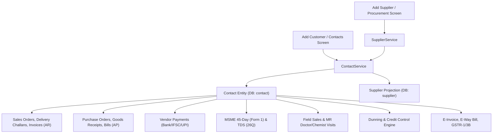
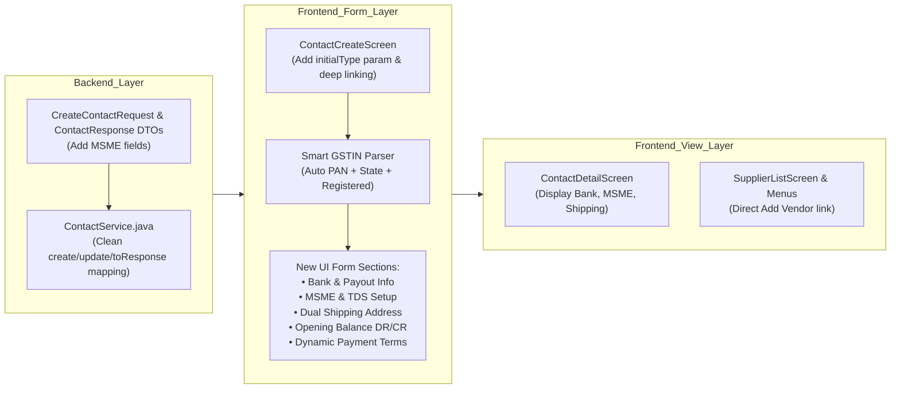

# Comprehensive Contact & Vendor Master Architecture & Improvement Plan

> **Document Status:** Complete Architecture Analysis & Execution Roadmap  
> **Last Updated:** 2026-08-15  
> **Target Subsystems:** `com.katasticho.erp.contact`, `com.katasticho.erp.procurement`, `flutter_app/lib/features/contacts/`, `flutter_app/lib/features/procurement/`

---

## 1. Full Backend Code & Subsystem Mapping

Katasticho ERP models Customers, Vendors, and Suppliers through a **Unified Contact Architecture** (`com.katasticho.erp.contact.entity.Contact`), with specialized role projections for procurement (`Supplier`).

### Direct Subsystem Touchpoints:
1. **Sales & Receivables (`com.katasticho.erp.ar` / `sales`)**:
   - `InvoiceService.java`: Evaluates `contact.isSalesHold()`, `contact.getCreditLimit()`, snapshots `billingAddress` and `shippingAddress`, applies `paymentTermsDays`, and increments `outstandingAr`.
   - `PaymentService.java` / `CustomerReceiptService.java`: Matches customer ledger and decrements `outstandingAr`.
   - `SalesOrderService.java`: Resolves customer `defaultPriceListId`, validates overdue balances, evaluates customer category.
   - `CreditNoteService.java`: Adjusts customer ledger and reduces outstanding AR.
   - `DeliveryChallanService.java`: Dispatches goods to customer `shippingAddress`.

2. **Purchases & Payables (`com.katasticho.erp.ap` / `procurement`)**:
   - `PurchaseBillService.java`: Evaluates `vendor.tdsApplicable`, `vendor.tdsSection`, `vendor.tdsRate`, tracks `vendor.msmeRegistered`, applies `paymentTermsDays`, and increments `outstandingAp`.
   - `VendorPaymentService.java`: Reads `bankName`, `bankAccountNo`, `bankIfsc`, `upiId` for batch payout generation and decrements `outstandingAp`.
   - `SupplierService.java`: Bidirectionally syncs party fields between `Contact` and `Supplier` entity tables.

3. **Statutory & MCA Compliance (`com.katasticho.erp.gst` / `report`)**:
   - `MsmeForm1Service.java`: Queries `contact.msmeRegistered`, `contact.msmeRegistrationNo`, and checks bills unpaid after 45 days (§43B(h)).
   - `Form26QExporter.java`: Extracts `contact.pan` and `contact.tdsSection` for quarterly income tax filing.
   - `GstService.java` & `EInvoiceService.java`: Validates 15-char GSTIN, Place of Supply (`placeOfSupply`), state codes, and postal codes for NIC/IRN clearance.

4. **Field Force & MR Routes (`com.katasticho.erp.fieldsales`)**:
   - `FieldSalesService.java`: Uses `medicalCategory` (DOCTOR/CHEMIST/STOCKIST/HOSPITAL), `mrClass` (A/B/C priority), `visitsPerMonth`, and geolocations for beat execution.

5. **Dunning & Automated Collections (`com.katasticho.erp.dunning`)**:
   - `DunningService.java`: Sweeps overdue invoices per contact, evaluates escalation level, dispatches payment reminders via email/WhatsApp/AI inbox.

---

## 2. Comparison with Modern ERPs (DualEntry, Zoho Books, Odoo)

| Feature Dimension | DualEntry / Zoho Books | Katasticho Previous State | Upgraded Target State |
| :--- | :--- | :--- | :--- |
| **Contextual Entry Points** | Dedicated "Add Customer" from Sales, "Add Vendor" from Purchases, "Add Contact" in CRM | Unified form defaulting only to Customer | Deep-linked `initialType` query param (`CUSTOMER` vs `VENDOR` vs `BOTH`), pre-configuring supplier switches |
| **Smart GSTIN Parser** | 1-tap parser: extracts PAN (chars 3-12), state name, state code, and auto-sets tax treatment | Derives only State Name from prefix | Auto-populates PAN from chars 3-12, sets `REGISTERED`, auto-derives state and state code |
| **Bank Account & Payouts** | Bank Name, Account Number, IFSC, UPI ID for automated vendor payouts | DB fields existed, but 0 UI input fields | Dedicated **Bank & Payout Details** collapsible section |
| **MSME & Statutory Details** | MSME Udyam Number + Micro/Small tag for §43B(h) compliance | DB fields existed, but 0 UI input fields | **MSME Registered switch + Udyam Number** field feeding MSME Form 1 |
| **Vendor TDS Configuration** | TDS Section (194C, 194J, 194Q) + custom rate override | DB fields existed, but 0 UI input fields | **TDS Configuration** section with section selector |
| **Dual Address Handling** | Dedicated Billing & Shipping blocks with 1-click "Same as Billing" copy | Only single Billing Address in UI | Dedicated **Shipping Address** block with "Same as Billing" toggle |
| **Opening Balance** | Opening balance with Debit (AR) / Credit (AP) indicator | DB field existed, missing in UI | **Opening Balance (₹)** with Debit/Credit selector |
| **Dynamic Payment Terms** | Named payment schedules linked to multi-instalment terms | Static hardcoded Net 30/60 days | Integrated with dynamic `/api/v1/payment-terms` |
| **Contact Details View** | Rich 360° overview with Bank Info, MSME badge, and Shipping address | Basic contact details card | Upgraded **360° Contact Detail Screen** with Bank, MSME, and Shipping cards |

---

## 3. Detailed Step-by-Step Change Plan

### Detailed Files to Modify:
1. **Backend DTOs & Service**:
   - `CreateContactRequest.java`: Add `Boolean msmeRegistered, String msmeRegistrationNo`.
   - `ContactResponse.java`: Add `boolean msmeRegistered, String msmeRegistrationNo`.
   - `ContactService.java`: Ensure clean mapping in `create()`, `update()`, and `toResponse()`.

2. **Frontend Form (`contact_create_screen.dart`)**:
   - Accept `initialType` parameter.
   - Smart GSTIN listener: Auto-extracts PAN (characters 3-12) if PAN is empty, auto-sets `REGISTERED`, auto-resolves state code.
   - Add **Bank & Payout Details** section: `_bankNameCtrl`, `_bankAccountNoCtrl`, `_bankIfscCtrl`, `_upiIdCtrl` with IFSC uppercase formatting.
   - Add **MSME Compliance** section: `_msmeRegistered` switch and `_msmeRegistrationNoCtrl`.
   - Add **TDS Configuration** section (for Vendors): `_tdsApplicable` switch, `_tdsSection` dropdown (`194C`, `194J`, `194Q`, `194H`, `194I`), and `_tdsRateCtrl`.
   - Add **Shipping Address** section: `_sameAsBilling` toggle (default true) + full shipping fields when unchecked.
   - Add **Financial Setup**: `_openingBalanceCtrl` with Debit/Credit toggle + dynamic payment terms.

3. **Frontend View & Procurement Integration (`contact_detail_screen.dart` & `supplier_list_screen.dart`)**:
   - `contact_detail_screen.dart`: Display Bank Details card, MSME Udyam badge, and Shipping Address card.
   - `supplier_list_screen.dart`: Connect "New Supplier" button to open `/contacts/create?type=VENDOR`.
   - `app_router.dart`: Support `type` query parameter in route `/contacts/create`.

---

## 4. Execution Tracker

- [x] **Step 1: Backend DTOs & Service Mapping**
  - Added `msmeRegistered` & `msmeRegistrationNo` to `CreateContactRequest.java`, `ContactResponse.java`, and `ContactService.java`.
- [x] **Step 2: Router Deep-Linking for Contact Creation**
  - Supported `initialType` query param in `app_router.dart` for `/contacts/create` (e.g. `/contacts/create?type=VENDOR`).
- [x] **Step 3: Comprehensive Form Upgrade (`contact_create_screen.dart`)**
  - Implemented Smart GSTIN parser (auto-extracts PAN from chars 3-12, sets `REGISTERED`, auto-derives state code).
  - Implemented **Bank & Payout Details** section (`bankName`, `bankAccountNo`, `bankIfsc`, `upiId`).
  - Implemented **MSME & Statutory Compliance** section (`msmeRegistered`, `msmeRegistrationNo`).
  - Implemented **Vendor TDS Configuration** section (`tdsApplicable`, `tdsSection`, `tdsRate`).
  - Implemented **Dual Address Management** (Billing + Shipping Address with "Same as Billing" toggle).
  - Implemented **Financial Setup** (Opening Balance with Debit/Credit selector + Dynamic Payment Terms).
- [x] **Step 4: Contact Detail Screen Upgrade (`contact_detail_screen.dart`)**
  - Rendered Receivables/Payables cards with `KMoney`, MSME status badge, TDS card, Bank details, and Shipping address.
- [x] **Step 5: Supplier List Screen Integration (`supplier_list_screen.dart`)**
  - Connected "New Supplier" action directly to Vendor contact creation (`/contacts/create?type=VENDOR`).
- [x] **Step 6: Automated Verification**
  - Verified backend compilation (`mvn test-compile`) with **0 errors**.
